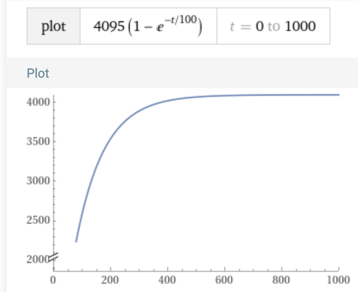
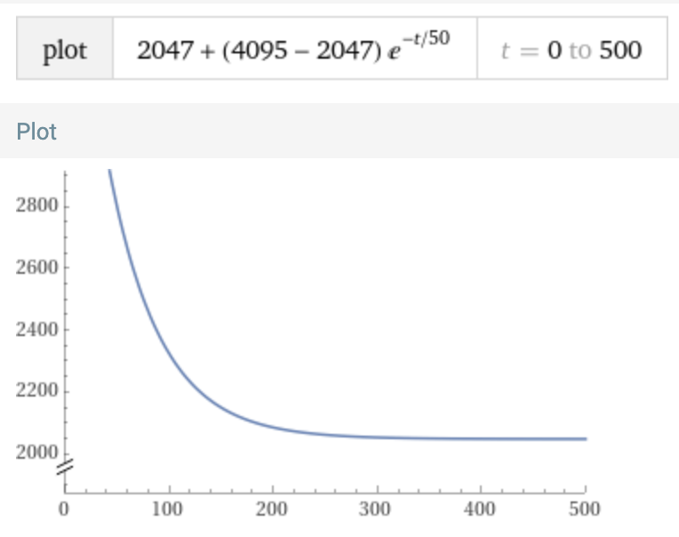

I'm using [Euler's number](https://en.wikipedia.org/wiki/E_(mathematical_constant)) to generate the exponential curves for the attack, decay, release curves in the ADSR. 

I've come up with variables called "scaling parameters" which let you adjust the aggressiveness of the attack, decay, release. The scaling parameter just lets us specify tau in terms of the attack/decay/release time. E.g. if attack_scaling_parameter is 5.0, and attack_T is 1000ms, then tau is 1000/5.0 = 200ms.

Using an attack scaling parameter of 10.0 (tau is 1/10 of T_attack)
Wolfram alpha link: https://www.wolframalpha.com/input?i=Plot%5B4095+%E2%80%8B++*+%281%E2%88%92+e%5E%28-t%2F100+%29%29%2C+%7Bt%2C+0%2C+1000%7D%5D



Using a decay scaling parameter of 10.0 (tau is 1/10 of T_decay)
Wolfram alpha link: https://www.wolframalpha.com/input?i=Plot%5B2047+%E2%80%8B+%2B+%284095+-+2047%29+*+%28e%5E%28-t%2F50+%29%29%2C+%7Bt%2C+0%2C+500%7D%5D




### Setting up the display:
I'm using a LilyGo TTGO display. I needed to do two things to get the TFT_eSPI library to work with my board:

1. I had to edit the `TFT_eSPI/User_Setup_Select.h`, commenting out the default include file, e.g.
> Line 27: `// #include <User_Setup.h>`
and uncommenting the line for the TTGO_T display.
> Line 58: `#include <User_Setups/Setup25_TTGO_T_Display.h>`

2. I had to edit `TFT_eSPI/Processors/TFT_eSPI_ESP32.h`, adding the following:
```
#if ESP_ARDUINO_VERSION_MAJOR >= 3
	#include "driver/gpio.h"
	#include <rom/ets_sys.h>
#endif
```
See: https://github.com/Bodmer/TFT_eSPI/issues/3346